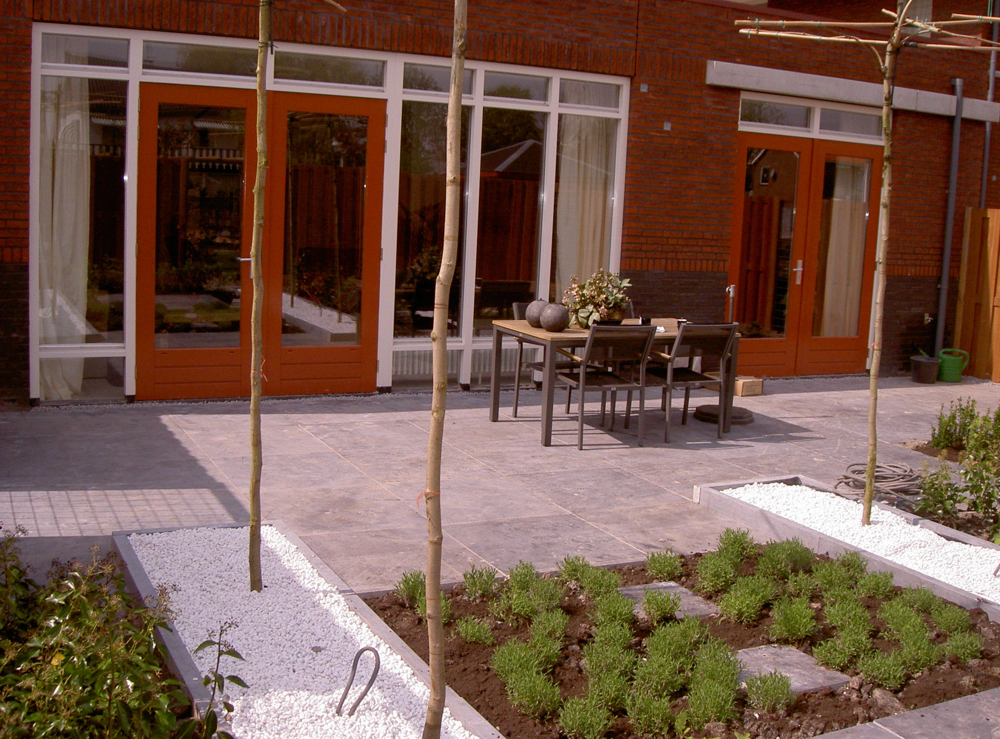

<article class="regular">
<header>
# Particulieren
</header>
<section>
Leef en woon omgeving

Fijn wonen en uw huis in het midden van een prettige omgeving is de wens van een ieder. Graag maken wij uw woonomgeving tot een plaats waar u trots op bent en u goed voelt, keus van styling.

Gedachtes van inrichting waarmaken, juiste erf afscheiding, mooie materialen, visie om uw tuin te betrekken als woon kamer bij uw huis. Wilt u een tuin, heeft u er hobby in, graag richten wij die voor u in, een mooie start voor een mooie tuin. Zoekt u een makkelijke tuin met mooie uitstraling dan is goed gekozen straatwerk belangrijk, met enkele fraaie plantenbakken. Beheersbaar en stijlvol.

Onderhoudsarme tuinen is ook onze keus, fraaie bloem bedden en vlinders en bijen, kijk eens rond op onze site. Wij adviseren graag voor uw tuin met optimaal bloem en groei proces. Onderhoud is een vak, of hobby, is dit niet uw hobby, spreek ons aan over uw wensen van onderhoud. Snoeibeurt, voorjaar klaarmaken, periodiek onderhoud, snoeien etc. maaibeurt tijdens uw vakantie. Oplossing gericht staan wij u bij met het onderhoud.

Terras vervuild door alg of andere vervuiling, spreek ons aan.

Wij het werk u het plezier is een levensvisie die wij u gunnen.
</section>
</article>
<aside>

particulieren

</aside>