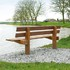

<article class="regular">
<header>
# Straatmeubilair
</header>
<section>
Voor elke organisatie en huis telt, de gekozen inrichting geeft de uit straling die u wenst. Goed gekozen materialen met juiste straatmeubilair, beïnvloed ook het gedrag van uw medewerkers en bezoekers van uw bedrijf.

Omgevingupgrade laat graag iedereen zich goed voelen op uw domein. Een doordacht plan opstellen voor een schone locatie, waar de route duidelijk is en plekken om te ontspannen en werken.

Voorbeelden van straatmeubilair: 

* Prullenbakken
* Fietsenrekken
* Asbakken
* Banken
* Speeltoestellen
* anti-parkeerpalen.

Tijdens pauzes nemen mensen die binnen werken graag even een luchtje. een bank of een picknicktafel is de aangewezen plek om even te relaxen met anderen. Een windkering van planten of tuinhout geeft uw mensen beschutting en onttrekken hun mogelijk gewenst uit het zicht. Rooklocatie is zo ook een prettigere plek, zeker met een mooie styling asbak om de straat schoon te houden.

Leveranciers onafhankelijk willen wij u helpen de juiste keuze te maken.

Plaatsing doen we in eigen beheer.
</section>
</article>
<aside>

straatmeubilair

straatmeubilair

</aside>