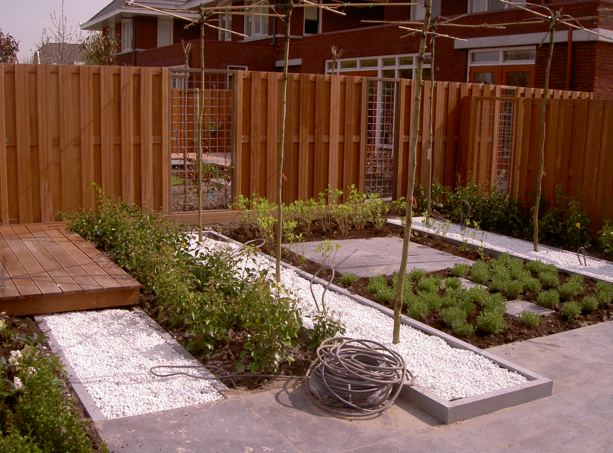
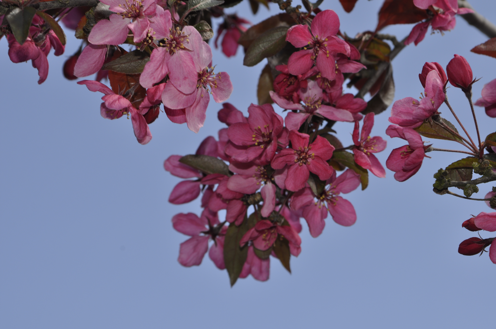

<article class="regular">
<header>
# Tuinaanleg en -inrichting
</header>
<section>
Voor elke locatie is de beplanting als een mooi garnituur op Uw bord, mooie groentes en vruchten naast Uw hoofdgerecht. 

Ideeën van vormgeven en ambiance creëren, samenspraak met u als opdrachtgever, uw visie uitwerken, onderhoud- en aanlegkosten beheersen. Uw hoofdzaak centraal stellen binnen de aanleg, uw omgeving moet leefbaar zijn en voldoen aan alle facetten.

Keuzes te over in aanleg, onderhoud is een belangrijke factor, mooi decor van uw pand is de inzet.

Graag attenderen wij  u op onderhoud  arme tuinen, die een plek zijn voor bloemen en grassen, biodiversiteit geven voor insecten en vogels.

Hopelijk kunnen wij samen een leuke gedachte vormen voor een mooie tuin rond uw vastgoed.

Enthousiast zullen wij dit voor u realiseren, zie onze andere pagina’s. Compleet Upgrade !
</section>
</article>
<aside>

tuinaanleg

tuinaanleg

</aside>