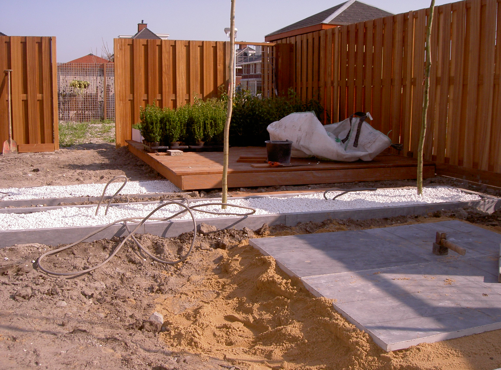

<article class="regular">
<header>
# Tuinhout
</header>
<section>
Mooi oplossingen met een natuurlijke uitstraling ontstaan door gebruik te maken van tuinhout van duurzame soorten , mooi hard hout of andere natuurlijke soorten.

Hout is inzetbaar voor schuttingen en vlonders , beschoeiing als keerwand , inrichting met een rustieke expressie. Fraaie overkapping of veranda .

Hoogte verschillen opvangen door beschoeiing, wind kering door een schutting, een afvalcontainer onttrekken aan het zicht, privacy creëren .

Omgevingupgrade beheerst deze timmermansvaardigheden , hout is net als de uitstraling ook  fijn om mee te werken  en geeft een fraai resultaat.

Bij inrichting en aanleg fijn om te gebruiken om Uw uitstraling mooi te maken.

Zie foto’s meerdere projecten .
</section>
</article>
<aside>

tuinhout

tuinhout

</aside>