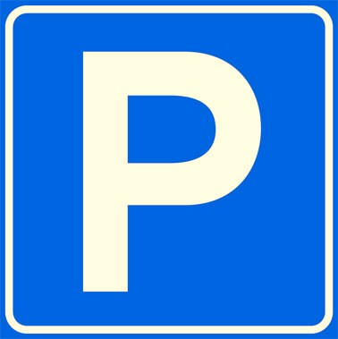

<article class="regular">
<header>
# Vastgoed
</header>
<section>
Elke organisatie is gehuisvest en heeft een buitengebied, welke de eerste indruk vormt voor uw medewerkers en bezoekers of bewoners.

Kantoren, wooncomplexen, sportverenigingen, bedrijfsterreinen hebben een uitstraling welke past bij het gebruik en soort organisatie  welke u bent.

Graag helpen wij uw uitstraling te verbeteren, door juiste plaatsing van afvalbakken en straatmeubilair kan uw locatie er mooier uit zien. 

Een voorbeeld zijn fietsbeugels, waar door de fietsen niet meer tegen de gevel staan maar praktisch en correct geplaatst kunnen worden op de plek  die u  als beheerder van uw locatie wenst. 

Onderhouden groen met bloemen geven ook een andere uitstraling dan de saaie bodembedekkers die vaak ook niet het onderhoud krijgen welke ze nodig hebben, ook dit kan onderhoudsarm. 

Parkeerplekken met uw logo geven aan dat uw bedrijf zorg draagt voor uw bezoekers. 

Mooie oplossingen voor uw rookplek voor uw medewerkers door met tuinhout en straatmeubilair een plek te geven die het aanzicht verbetert en comfort gevoel vergroot. Door efficiënte inrichting is het mogelijk uw locatie als prettige verblijfsplek te maken. 

Meerdere disciplines kunnen wij u aanbieden, kijk  naar onze mogelijkheden. Oplossingsgericht willen wij u helpen. 

Schoonmaak en onderhoud worden makkelijker met prullenbakken en asbakken, welke leverancier onafhankelijk kunnen worden aangeboden.

Vele organisaties hebben personeel welke tijdens hun pauze even een frisse neus of de zonnewarmte willen voelen, graag geven wij  u een passend advies voor uw situatie zodat ze op een prettige manier hun relax moment kunnen beleven. Leuke picknicktafel of parkbanken, windluw door een haag of andere vorm van windkering.

Haal de mogelijkheden uit uw locatie en vergroot het welzijnsgevoel.
</section>
</article>
<aside>

vastgoed

</aside>